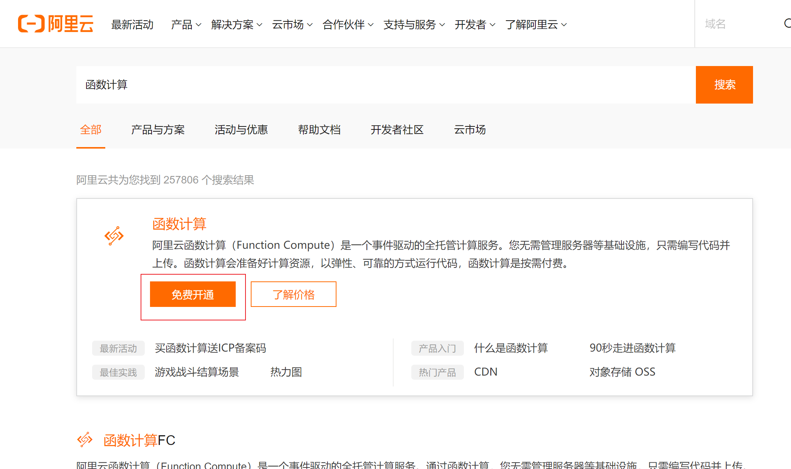
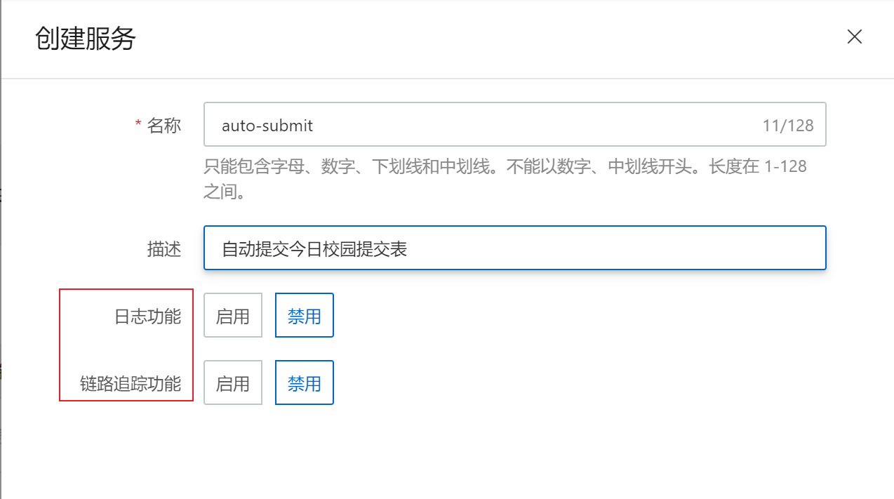
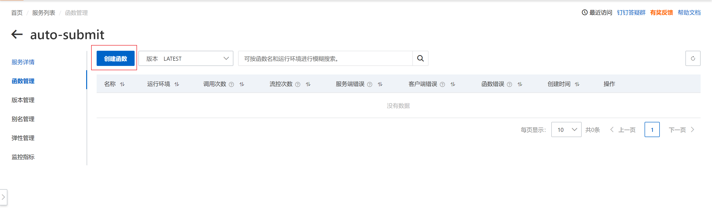
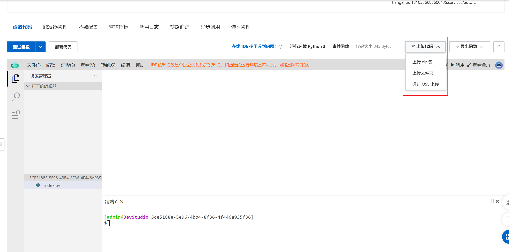
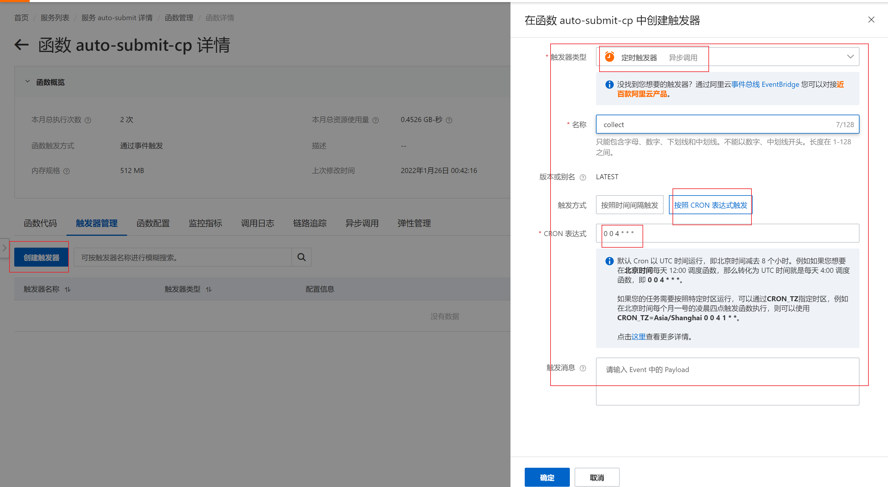
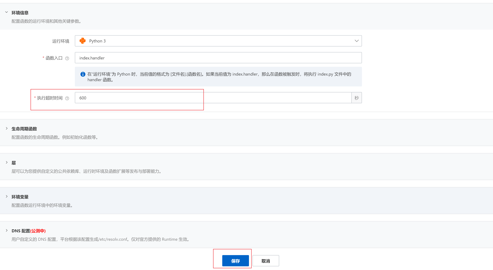
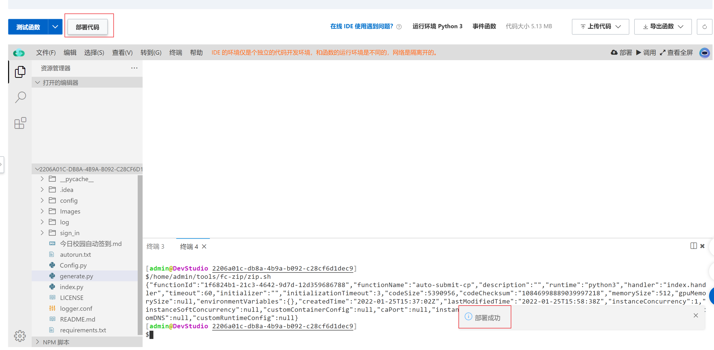
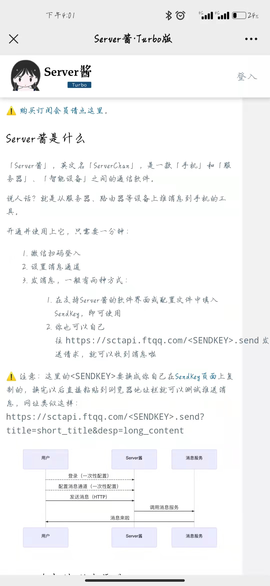

# collect-cp
仅用于今日校园自动提交表单

删除了一个说明文件，那个文件写的是过程，之前写的零零碎碎太多小错误了，比如明明是加密，我写个解密😂，这些我都修改了，其他错误我懒得改了，请不要计较太多，感兴趣可以去我公众号和b站看，我一般是github上先更新，功能基本完善了才会上传公众号和b站，但我这几个账号和我平时用的又不一样，看得都少，但看到我基本都会回，有事可以发邮件，`index.py`里有我的邮件。

## *==此代码开源使用，旨在为学生提供便捷，禁止将此代码用于盈利，禁止学生将此代码用于不正当地方，如果有问题一定要如实填报==*

[TOC]


## 前言

**==搞这东西太费时间了，很有可能我不会在更新，我另一个说明文件里的参考中有还在更新的且做得比我更好。==**

### 1.版本控制

>| version | 变换及提升   |
>| ------- | ------------ |
>| 1.0     | 基本功能完善 |

### 2.待办事项

- [x] 增加微信通知功能


### 3.小吐槽

**部署到云端，代码里不能打印中文，现在我注释掉了所有日志，需要的自己取消注释，真的是写代码日志写得飞起，写完现在改也改得飞起，吃一堑长一智，以后我代码能用英文都用英文😂**

## 一、配置文件

在项目根目录下运行`generate.py文件`,如下图所示，对`大连大学`支持更佳，其他学校没试过

**==配置文件经度纬度不一定与地址一致，有这个需求也可以自行网上搜索在线查询经纬度，很多这样的网站==**


## 二、部署项目

### 1.本地运行（windows）其他环境请自行研究

#### 1.批处理文件

>1. 打开`autorun.txt`填写项目绝对路径
>2. 保存，将后缀名改为.bat，改完名字`autorun.bat`
>3. win+r,输入shell:startup
>4. 将`autorun.bat`文件移至打开的文件夹中


#### 2.配置运行环境

**~~关于如何配置python运行环境(项目使用3.7版本)~~，不一定一样)请自行搜索，网上有很多教程不再赘述**

现在一般电脑好像都自带python环境

验证

> win+r,输入cmd,进入命令提示符，输入python -V,下方出现版本号就有，报错就需要自行安装

1. win+r, 输入cmd

   ```shell
   pip3 install -r requirements.txt
   ```

   有的下载比较慢可以加一个镜像源

   ```shell
   pip3 install -r requirements.txt -i https://pypi.tuna.tsinghua.edu.cn/simple
   ```

   

到此你的环境已经部署在本地，每天打开电脑他就会运行

### 2.云函数~~(请自行研究，网上也有许多教程)~~

#### 1.进入阿里云，注册/登录，开通函数计算服务

[点击打开阿里云函数](https://www.aliyun.com/search?spm=5176.19720258.J_8058803260.14.54212c4aoGhn1M&scene=all&k=%E5%87%BD%E6%95%B0%E8%AE%A1%E7%AE%97)，点击免费开通



#### 2.点击服务及函数，点击创建服务


输入表单，**日志和链路追踪会产生额外费用自行选择开还是不开**



#### 3.点击创建函数



使用默认选项即可，内存大点无所谓，反正不要钱不是😜


#### 4.上传代码

上传代码，我的代码在本地，我直接就上传项目文件夹了，上传压缩包它里面有层套娃，一会操作时注意路径



#### 5.个人配置

输入

```sh
python generate.py
```

然后自己在终端输入自己个人信息，生成个人配置


**==注意配置文件能在本地生成就在本地生成，远程操作一个失误你就得重新配置==**

#### 6，配置运行环境

输入

```sh
pwd
```

他会返回一个地址如：/home/dfounderliu/code/pillowtest

直接粘贴不用加引号

```sh
sudo pip3 install -r requirements.txt -t 地址
```


显示Successflly ...即可

#### 7.设置定时器



改变函数执行超时时间



#### 8.部署

点击部署代码

**每次修改了设置或者代码都要重新部署**




## 三、通知结果

~~这个东西看吧，因为我个人被很多垃圾邮件困扰，烦不胜烦，我是不倾向于做一个邮件通知的。当然可以自己做的可以自行修改代码，放在我的TODO下面。~~

~~个人这几天在搞公众号，看能不能实现公众号通知。~~

该方法默认关闭，需要自己再`config`文件夹下的`config.json`中打开

这个也搞定了，用server酱结果图见下


### 使用方法

#### 1.关注公众号方糖


#### 2.登入



#### 3.获取sendkey


#### 4.将sendkey填入配置文件

**==注意非会员一天仅能发5条，不要一直去试==**


## 结果


显示提交成功


## 广告

在我的个人公众号中获取最新状态


在b站[点击](https://space.bilibili.com/686725252)看我的小玩意儿
